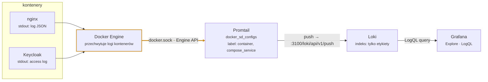

# Obserwowalność testów: logi Nginx w Grafana Loki

k6 po zakończonym teście pokazuje statystyki takie jak `http_req_duration` czy rozkład kodów odpowiedzi, ale to zawsze widok **z perspektywy klienta**. Kiedy testujemy np. rate limiting na Nginx (patrz rozdział o modelowaniu obciążenia), k6 powie Ci ile żądań dostało `429`, ale nie powie *dlaczego* akurat te, ani jak zachowywał się serwer w danym momencie. Żeby to zobaczyć, potrzebujemy logów serwera skorelowanych w czasie z przebiegiem testu — i tu przydaje się **Grafana Loki**.

## Czym jest Loki

Loki to system agregacji logów stworzony przez Grafana Labs, często opisywany jako *„Prometheus, ale dla logów”*. W przeciwieństwie do klasycznych rozwiązań (np. Elasticsearch), Loki **nie indeksuje pełnej treści logów** — indeksuje wyłącznie etykiety (labels) przypisane do strumienia logów, a samą treść przechowuje skompresowaną. Dzięki temu jest znacznie tańszy i szybszy przy dużych wolumenach danych, takich jak logi dostępu z Nginx generowane podczas testu obciążeniowego.



Architektura składa się z trzech elementów:

- **Agent zbierający logi** (np. Promtail) – czyta logi (najczęściej ze stdout kontenerów) i wysyła je do Loki, dodając etykiety.
- **Loki** – przechowuje logi, indeksuje tylko etykiety, udostępnia API do zapytań (LogQL).
- **Grafana** – łączy się z Loki jako źródłem danych i pozwala przeszukiwać logi oraz budować dashboardy.

## Zbieranie logów kontenerów Dockera

Promtail potrafi automatycznie odkrywać kontenery Dockera i przesyłać ich logi bez konieczności montowania plików z hosta – wystarczy dostęp do socketa Dockera. To ważne w środowisku warsztatowym, gdzie uczestnicy mogą mieć Dockera na Linuksie, macOS albo Windows (Docker Desktop) – rozwiązanie oparte na pliku logów hosta (`/var/lib/docker/containers`) działałoby inaczej na każdej z tych platform.

```yaml
scrape_configs:
  - job_name: docker
    docker_sd_configs:
      - host: unix:///var/run/docker.sock
        refresh_interval: 5s
    relabel_configs:
      - source_labels: ['__meta_docker_container_name']
        regex: '/(.*)'
        target_label: 'container'
```

Powyższa konfiguracja odkrywa wszystkie kontenery i etykietuje ich logi nazwą kontenera (`container`), np. `nginx`, `keycloak`. Etykiety w Loki działają jak wymiary, po których później filtrujemy i grupujemy zapytania — podobnie jak w Prometheusie.

## Strukturyzowane logi = łatwiejsze zapytania

Domyślny format logów Nginx (`combined`) to zwykły tekst:

```
83.30.43.237 - - [22/Sep/2026:21:10:06 +0000] "GET /realms/sample-app/... HTTP/2.0" 200 314
```

Żeby wyciągnąć z takiej linii konkretne pole (np. kod odpowiedzi), LogQL musiałby użyć regexa dopasowanego dokładnie do tego formatu. Dużo wygodniej jest logować od razu w formacie JSON – wtedy Loki potrafi go sparsować jednym poleceniem `| json`.

```nginx
log_format json_combined escape=json '{'
    '"time":"$time_iso8601",'
    '"remote_addr":"$remote_addr",'
    '"request_uri":"$request_uri",'
    '"status":$status,'
    '"request_time":$request_time'
'}';

access_log /dev/stdout json_combined;
```

> Uwaga: `access_log` zadeklarowany na tym samym poziomie kontekstu co domyślny wpis z bazowego `nginx.conf` **dopisuje się** do niego, a nie go zastępuje – każde żądanie zostałoby wtedy zalogowane dwa razy (raz w JSON, raz w formacie domyślnym). Żeby tego uniknąć, `access_log` trzeba zadeklarować wewnątrz bloku `server {}` – dyrektywa na bardziej zagnieżdżonym poziomie zastępuje tę odziedziczoną z poziomu wyżej.

## LogQL – podstawy

LogQL to język zapytań Loki, wzorowany na PromQL. Zapytanie zaczyna się zawsze od **selektora strumienia** (wybór etykiet), po którym można dodawać kolejne etapy przetwarzania (pipeline).

### Filtrowanie logów w Explore

Zaczynamy od samego selektora strumienia – to zwraca surowe linie logów z kontenera `nginx`, bez żadnego przetwarzania. Taki zapis możesz od razu wkleić do zakładki **Explore** w Grafanie:

```logql
{container="nginx"}
```

Najważniejsze etapy pipeline'u, które możemy doczepiać do selektora:

- `| json` – parsuje linię jako JSON, wyciągnięte pola stają się dostępne jak etykiety (ale nieindeksowane).
- `|= "token"` – filtr tekstowy (linia musi zawierać podany ciąg).
- `| status="429"` – filtr po wyciągniętym polu.
- `| line_format` \`{{.request_uri}}\` – nadpisuje treść linii wybraną wartością pola (przydatne do dalszego przetwarzania).
- `| regexp` – wyciąga fragmenty linii do nowych etykiet za pomocą wyrażenia regularnego.
- `| unwrap <pole>` – zamienia wartość pola (liczbę) na próbkę metryki, wymagane do funkcji typu `avg_over_time`.

Zbudujmy przykład krok po kroku, dodając po jednym elemencie na raz. Dodajemy `| json`, żeby rozbić każdą linię (będącą JSON-em) na pola. Wynik nadal jest listą linii logów, ale teraz każda z nich ma "doczepione" pola takie jak `status` czy `request_uri`, po których można dalej filtrować:

```logql
{container="nginx"} | json
```

Filtrujemy po jednym z wyciągniętych pól – zostają tylko linie, w których `status` to `429`:

```logql
{container="nginx"} | json | status="429"
```

To wciąż zapytanie zwracające *linie logów* (widziałbyś je jako listę w panelu "Logs" w Explore). Żeby zamiast linii dostać **liczbę** – ile ich było w danym przedziale czasu – opakowujemy całe zapytanie funkcją `count_over_time`, podając w nawiasach kwadratowych okno czasowe (`$__interval` to zmienna Grafany, która dobiera je automatycznie do szerokości wykresu):

```logql
count_over_time({container="nginx"} | json | status="429" [$__interval])
```

Explore od razu przełączy się na widok wykresu – to nasze pierwsze zapytanie metryczne.

### Szukanie jednego żądania w kilku kontenerach

Dotąd filtrowaliśmy po polach JSON z logów nginx. Przy debugowaniu często chcemy znaleźć **jedno konkretne żądanie i zobaczyć je po obu stronach** – w nginx oraz w Keycloaku. Keycloak też potrafi logować każde żądanie HTTP (tzw. access log, włączany opcją `KC_HTTP_ACCESS_LOG_ENABLED`), a ponieważ Promtail zbiera logi wszystkich kontenerów, obie linie trafiają do Loki i możemy pobrać je jednym zapytaniem.

Załóżmy, że skrypt k6 dopisuje do każdego żądania parametr `?id=sample-app-<numer>`. To samo żądanie wygląda w logach tak:

nginx (JSON):

```
{"time":"2026-09-26T10:47:11+00:00","remote_addr":"83.30.43.237","request_method":"GET","request_uri":"/resources/8kf24/login/keycloak.v2/img/keycloak-logo-text.svg?id=sample-app-1","status":200,"request_time":0.012,"upstream_response_time":"0.011", ...}
```

Keycloak (zwykły tekst):

```
2026-09-26 10:47:11,196 INFO  [org.keycloak.http.access-log] (executor-thread-1) ip=83.30.43.237 method=GET uri="/resources/8kf24/login/keycloak.v2/img/keycloak-logo-text.svg?id=sample-app-1" status=200 bytes=7009 duration_ms=4
```

Log Keycloaka nie jest JSON-em, więc `| json` tu nie pomoże – potrzebujemy filtra działającego na surowym tekście linii. Zapytanie wygląda tak:

```logql
{container=~"nginx|keycloak"} |~ `[?&]id=sample-app-1(&|")`
```

Jak je czytać:

- `{container=~"nginx|keycloak"}` – `=~` to dopasowanie etykiety wyrażeniem regularnym, więc selektor obejmuje oba kontenery naraz (zwykłe `=` wymaga jednej dokładnej wartości).
- `|~` – filtr linii: zostają tylko linie pasujące do wyrażenia regularnego (szukanego w dowolnym miejscu linii). Backticki tworzą surowy ciąg, więc nie musimy escapować cudzysłowu.
- `[?&]` – parametr w query stringu zaczyna się po `?` albo `&`. Dzięki temu `id` musi być całą nazwą parametru.
- `id=sample-app-1` – szukana nazwa i wartość parametru.
- `(&|")` – po wartości musi stać `&` (idzie kolejny parametr) albo `"` (koniec adresu – w obu logach URI jest w cudzysłowie).

Dlaczego nie użyć prostszego `|= "id=sample-app-1"`? Bo taki filtr złapie też `client_id=sample-app-1` oraz `id=sample-app-10`, `id=sample-app-11` itd. Końcówka `(&|")` odcina dłuższe wartości. Żeby zamiast jednego numeru złapać dowolny, użyj `[?&]id=sample-app-\d+(&|")`.

W wyniku dostaniesz dwie linie obok siebie. W nginx widać `request_time` i `upstream_response_time` (sekundy), a w Keycloaku `duration_ms` (milisekundy). Jeśli między nginx a Keycloakiem stoi Toxiproxy z dodanym opóźnieniem, różnica między tymi wartościami pokazuje, ile czasu „zjadła” sieć i proxy, a ile faktycznie zajęło samo przetwarzanie w Keycloaku.

> Uwaga: adresy zasobów motywu (`/resources/<hash>/...`) mają hash zależny od wersji Keycloaka. Przy nieaktualnym hashu Keycloak odpowiada kodem `307` i przekierowuje na nowy adres **bez query stringa** – drugie żądanie nie ma wtedy `?id=...`, więc filtr go nie pokaże.

### Budowa metryk: count i average per kod odpowiedzi

Powyższe zapytanie liczy tylko żądania `429`. Gdybyśmy chcieli zobaczyć **wszystkie** statusy naraz, każdy jako osobna linia na wykresie, usuwamy filtr `status="429"` i zamiast niego grupujemy wynik funkcją `sum by (status)` – dla każdej napotkanej wartości pola `status` policzy ona osobną sumę:

```logql
sum by (status) (count_over_time({container="nginx"} | json [$__interval]))
```

To dokładnie zapytanie z panelu "Liczba requestów wg kodu odpowiedzi" w naszym dashboardzie.

Oprócz zliczania linii możemy też **uśredniać wartość liczbową** wyciągniętą z pola JSON – np. czas trwania żądania (`request_time`). Do tego służy `| unwrap`, które zamienia wartość pola na próbkę metryki, oraz `avg_over_time`, które liczy jej średnią w oknie czasowym:

```logql
avg by (status) (
  avg_over_time(
    {container="nginx"} | json | __error__="" | unwrap request_time [$__interval]
  )
)
```

`__error__=""` odfiltrowuje linie, których nie udało się sparsować jako JSON – bez tego `unwrap` mógłby natrafić na pole, którego w ogóle nie ma. Ciekawa obserwacja: żądania zakończone `429` powinny mieć znacznie **niższy** średni `request_time` niż `200` – są odrzucane przez `limit_req` w Nginx, zanim w ogóle trafią do Keycloaka.

Zwróć uwagę, że grupowanie po `status` jest tu proste, bo to pole ma tylko kilka możliwych wartości (200, 429, ewentualnie inne kody błędów). Grupowanie po ścieżce (`request_uri`) jest trudniejsze, bo pole to zawiera też query string – każdym zapytaniem mogłoby wylądować jako osobna seria. Tym zajmiesz się w zadaniach.

## Budowa dashboardu w Grafanie na bazie Loki

Mając logi w formacie JSON, zbudowanie dashboardu z konkretnymi metrykami sprowadza się do napisania kilku zapytań LogQL. Poniżej trzy panele przydatne przy analizie testów k6 uderzających w API zabezpieczone rate limitem.

**Liczba requestów wg kodu odpowiedzi** – klasyczne zliczanie po etykiecie wyciągniętej z JSON-a:

```logql
sum by (status) (
  count_over_time({container="nginx"} | json | __error__="" [$__interval])
)
```

`__error__=""` odfiltrowuje linie, których nie udało się sparsować jako JSON (np. logi błędów Nginx, które mają inny format) – bez tego zapytanie by nie wybuchło, ale wliczałoby też nieparsowalne linie do wyniku.

**Liczba requestów wg ścieżki** – tu problemem jest to, że `request_uri` zawiera też query string (`?username=test&max=5`), więc każde żądanie mogłoby wylądować jako osobna seria. Rozwiązaniem jest podmiana treści linii na sam `request_uri`, a potem regex wycinający wszystko przed `?`:

```logql
sum by (request_path) (
  count_over_time(
    {container="nginx"} | json | __error__=""
    | line_format `{{.request_uri}}`
    | regexp `(?P<request_path>[^?]*)`
    [$__interval]
  )
)
```

**Średni czas odpowiedzi wg ścieżki** – tu zamiast zliczać linie, potrzebujemy uśrednić wartość liczbową (`request_time`). Do tego służy `unwrap`:

```logql
avg by (request_path) (
  avg_over_time(
    {container="nginx"} | json | __error__=""
    | line_format `{{.request_uri}}`
    | regexp `(?P<request_path>[^?]*)`
    | unwrap request_time
    [$__interval]
  )
)
```

Każde z tych zapytań wklejamy do panelu typu *Time series* w Grafanie, wybierając Loki jako źródło danych.

## Prowizjonowanie dashboardu (Infrastructure as Code)

Zamiast klikać dashboard ręcznie w UI (co trzeba by powtarzać na każdym środowisku), Grafana pozwala go zdefiniować jako plik JSON i zaprowizjonować automatycznie przy starcie kontenera:

```yaml
# grafana-provisioning/dashboards/dashboards.yml
apiVersion: 1
providers:
  - name: default
    type: file
    options:
      path: /etc/grafana/provisioning/dashboards
```

Do tego samego katalogu wystarczy dorzucić eksportowany model dashboardu (`nginx-overview.json`) i zamontować cały folder `grafana-provisioning/` do kontenera Grafany. Przy każdym starcie stacka (`docker compose up`) dashboard pojawi się automatycznie, bez ręcznej konfiguracji – identycznie jak w przypadku źródeł danych (`datasources.yml`).

## Linki

- Dokumentacja Loki: [https://grafana.com/docs/loki/latest/](https://grafana.com/docs/loki/latest/)
- LogQL: [https://grafana.com/docs/loki/latest/query/](https://grafana.com/docs/loki/latest/query/)
- Provisioning dashboardów w Grafanie: [https://grafana.com/docs/grafana/latest/administration/provisioning/#dashboards](https://grafana.com/docs/grafana/latest/administration/provisioning/#dashboards)
