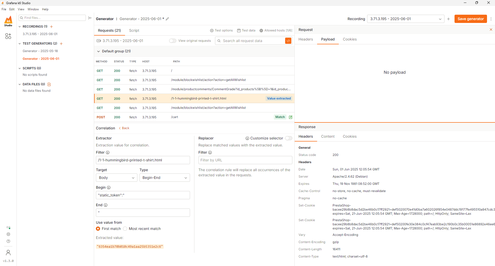

# k6 Studio

Nagrywanie testów do plików HAR i konwersja do skryptów k6 ułatwia znacząco pracę. Ciągle jednak musimy włożyć sporo pracy aby uzupełnić skrypt o przekazywanie danych pomiędzy krokami oraz pobieranie danych do testów. k6 Studio to nowe narzędzie, które ma nam znacząco pomóc w tym zakresie

## Instalacja

Narzędzie k6 Studio znajdziesz pod linkiem [https://github.com/grafana/k6-studio/releases](https://github.com/grafana/k6-studio/releases). Należy pobrać wersję dla wybranego systemu operacyjnego i zainstalować.

## Praca z k6 Studio

### Nagrywanie testu

Po uruchomieniu narzędzia mamy możliwość rozpoczęcia nagrania kroków dla opracowywanego scenariusza z wykorzystaniem przeglądarki. Zwróć uwagę, że w czasie testów możesz tworzyć grupy, do których będą trafiać kolejno wykonywane zapytania. Po zatrzymaniu nagrania masz możliwość przeglądania zapytań i odpowiedzi jak również renderowania kodu html.

### Generowanie testu

Po udanym nagraniu, możemy przejść do kolejnego etapu, który odbywa się w sekcji Test Generator. W pierwszym kroku masz możliwość odfiltrowania zapytań nad jakimi chcesz dalej pracować na podstawie ich domeny oraz dodania checków sprawdzających kody odpowiedzi z kodami z nagrania. Na tym etapie masz też możliwość ustawienia parametrów testu takich jak jego długość, rodzaj egzekutora oraz docelowe obciążenie.

Test Generator pozwala również na dodanie plików z danymi do testów, uzupełnienie checków oraz dodanie korelacji pomiędzy zapytaniami. Przykład poniżej pokazuje Extractor, który:
* Poszukuje zapytania o podanym adresie URL
* Wybiera z treści odpowiedzi tekst na podstawie kryteriów Begin-End
* Zastępuje wystąpienia znalezionego tekstu na odwołanie do odpowiedniej zmiennej 



W wyniku działania tego elementu w odpowiedniej części skryptu pojawi się poniższych kod oraz wystąpienia znalezionego testu zostaną zastąpione odwołaniem do zmiennej correlation_vars["correlation_0"]

```javascript
regex = new RegExp('"static_token":"(.*?)"');
match = resp.body.match(regex);
if (match) {
    correlation_vars["correlation_0"] = match[1];
}
```

Test Generator pozwala nam na walidację skryptu i oceną poprawności jego działania. 

### Eksporotwanie skryptu

Ostatnim krokiem jest eksport testu, który możemy dalej edytować w IDE.
